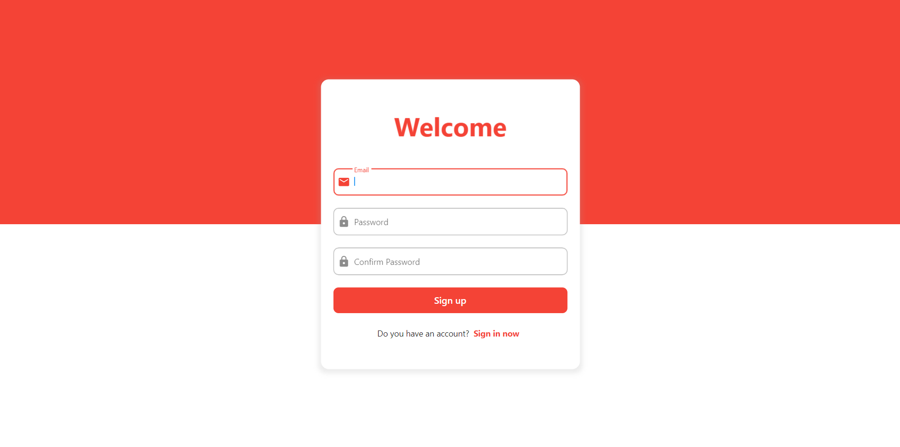

# Flutter Web Auth

A fully working Flutter Web Authentication System with Firebase

Made with ❤ by Moaz El-sawaf

## How to use?

1. Create a Firebase Project.
2. Enable the "Email/Password" method in Authentication Section in Firebase Console.
3. Navigate to project settings in Firebase Console, then under "Your apps" section, create a web app.
4. In the web app you have created you will find a section labeled "Firebase SDK snippet", choose Config then copy the whole code snippet.
5. Replace the line saying "// Replace me ..." in "web/index.html" with the copied code snippet.
6. Run the app and Enjoy! ❤

## Screenshots

### Sign up

### Sign in

### Home

